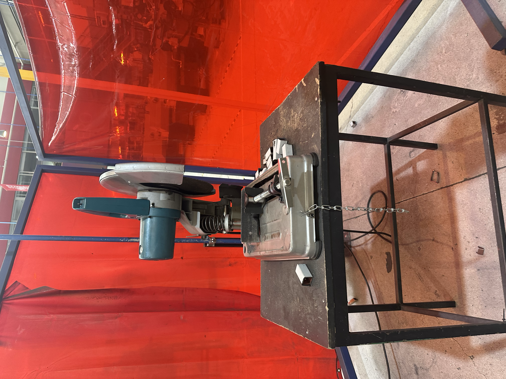
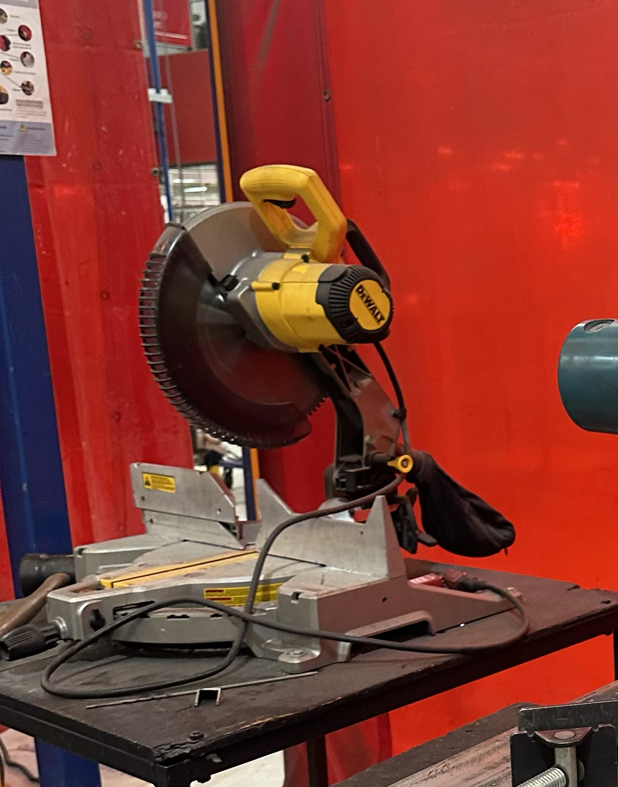
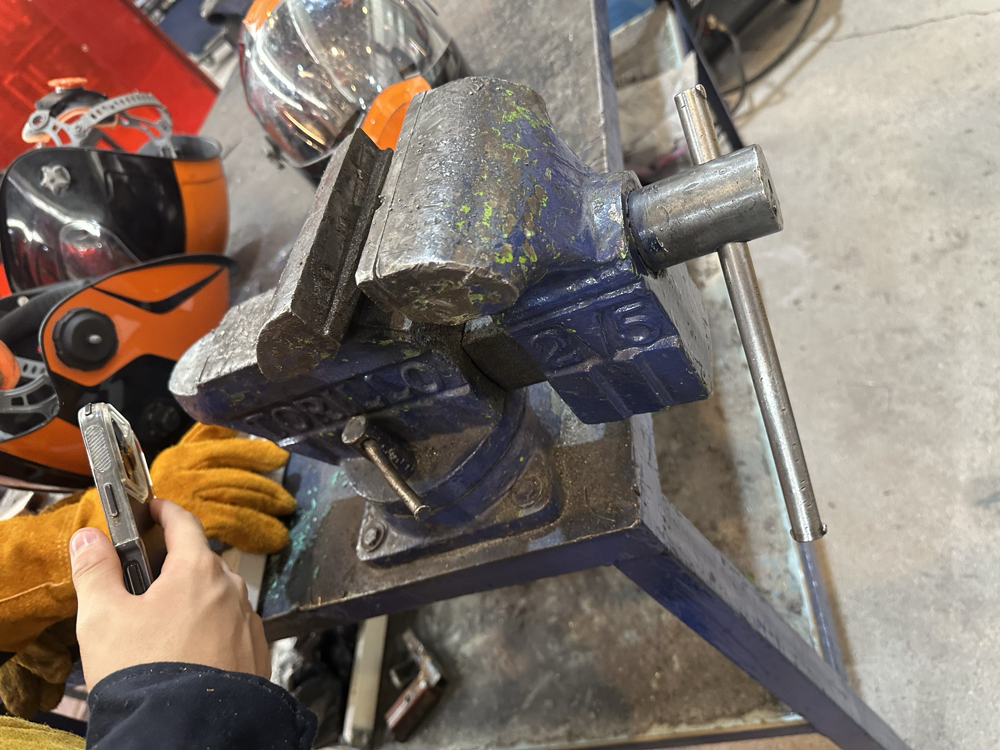
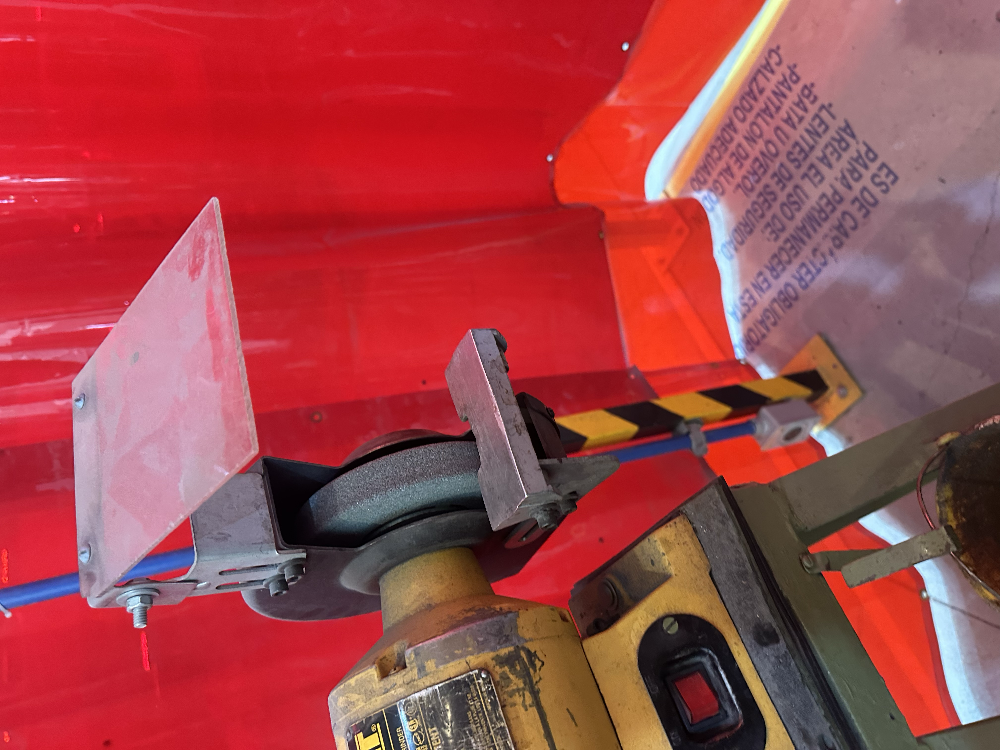
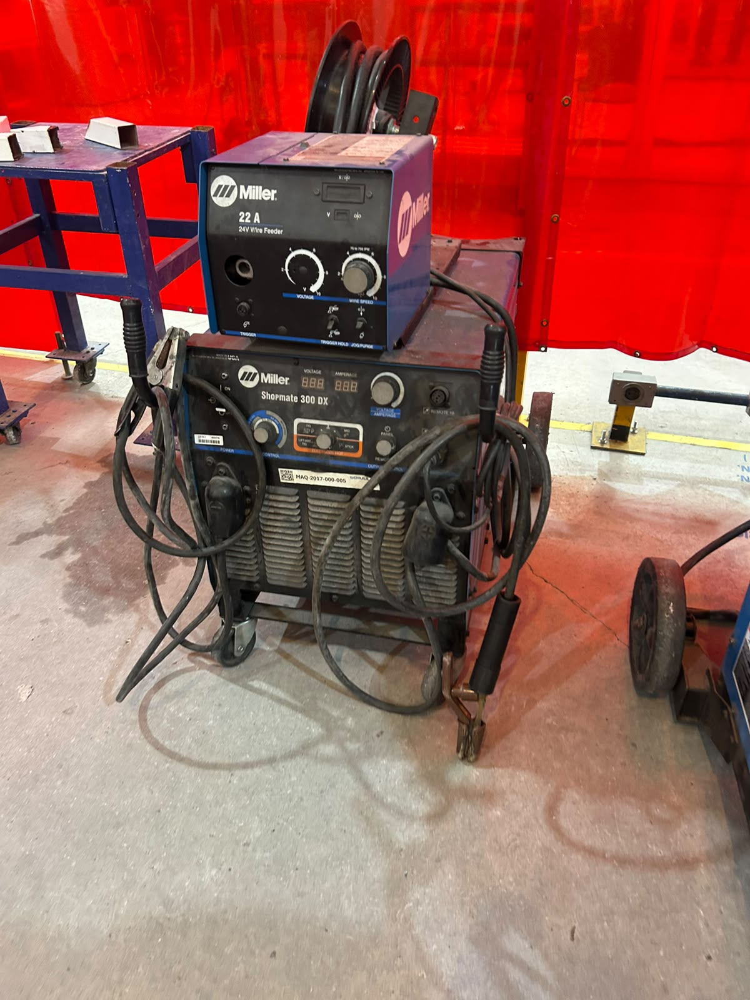

# Reporte Practica en el IDIT Soldadura 
## (28/Agosto/2026)

El viernes en la clase de Proyecto de Ingeniería estuvimos en el IDIT en el área para soldar y cortar piezas de metal.

Al inicio de la clase el profesor nos presento al señor Cholula que era el encargado del lugar y el que nos podía apoyar en alguna duda que tuviéramos , después de presentarnos nos pusimos las batas y las botas de casquillo ya que por las herramientas y los materiales podría ser un poco peligroso y en caso de tener un accidente podría dañarnos físicamente, aparte de la bata y las botas el profesor nos pidió que fuéramos a almacén a traer equipo extra de protección los cuales fueron guantes, lentes de protección, careta para soldar, y una pechera.

Despues el señor Cholula y el profesor nos empezaron a explicar como funcionaba cada herramienta que íbamos a utilizar para poder soldar, empezamos conectando la soldadora a corriente y nos explicaron que normalmente se ocupaba mas energía para soldar diferentes metales, pero nosotros íbamos a trabajar con menos porque era nuestra primera vez soldando, con las pinzas de la soldadora una se anclo a la mesa la que hacia función de tierra y la otra pinza iba agarrada de una barra para soldar, el señor Ochoca agarro pedazos de metal que ya estaban desgastados para que nos explicaba como se hacia, algo importante que nos dijo tanto el señor Cholula como el profesor es que siempre que vayamos a soldar tengamos puestas nuestras caretas y asegurarnos que las personas con las que estemos las tengan puesta, después de revisar que todos tuviéramos las caretas puestas empezamos a ver como se agarraba la pinza para que fuera mas cómodo, nos explico que para que fuera una buena soldadura si al final podíamos quitar el exceso fácilmente eso significaba que la soldadura había quedado bien.

También nos explico q si mientras soldábamos la luz que veíamos se empezaba a ver mas suave era porque estábamos separando la soldadura del pedazo de metal, algo importante que debiamos de saber era que si mientras estabamos soldando se nos quedaba pegado con el metal teniamos que apagar la fuente de corriente para evitar accidentes, tambien nos explicaron que no debiamos de tocar la soldadura con la mesa porque podriamos sacar chispas. Despues de que nos explicaran todo lo necesario pasamos uno por uno para pracitcar con bloques de metal.

Despues de practicar la soldadura pasamos a la parte de las sierras, donde tambien nos explicaron las medidas de seguridad, las que mas destacaron fueron que siempre revisaramos que la pieza estuviera bien colocada y que no tuviera juego para que al momento de cortar no se moviera la pieza, tambien nos dijeron que siempre teniamos que estar a un costado de la sierra para que tuvieramos mas control de la sierra, el profesor nos comento que a la hora de hacer el corte fuera algo seguro y que no estuvieramos subiendo y bajando la sierra, solo levantarla hasta que el corte estuviera echo, despues de que nos explico como utilizarla pasamos cada quien ah practicar, habia dos tipos de sierra las cuales estaban a 90°y 45° esto para que pudieramos hacer cortes de diferente tipo.

Despues de esto pasamos a una maquina que servia para poder quitar el exceso que sobraba de la sierra, esto ayudaba para cuando tuvieramos que soldar otra vez no se nos hiciera tan complicado, la maquina era como una lija que giraba muy rapido y tenia una base de metal para que pudieras apoyarte, pasamos uno por uno con el profesor para que nos explicara individualmente, despues de que todos pasamos pasamos a soldar las piezas de metal que ya habiamos cortado y lijado pero por el tiempo solo lo pudo hacer una compañera. 

Al terminar la practica recogimos todos los materiales que utilizamos y devolvimos los materiales al almacen.

# Materiales que utilizamos y para que sirven 

  

Esta es la sierra ah 90°, esta nos permite cortar pedazos de ciertos metales y que los cortes salgan a 90°, tanto con esta y con las demas sierras hay que tener en cuenta que se comen un poco de pedazos por la anchura de la sierra.

  

Esta es la sierra a 45°, es exactamente igual que la sierra de 90° solo que esta tiene un angulo diferente y hace cortes a diferentes medidas.

  

En esta herramineta podemos apoyarnos para quitar imperfecciones de los pedazos de metal, normalmente se ocupa para quitar cualquier exceso que haya sobrado de cortar algun metal.

  

Esta es la maquina que nos ayuda a lijar los pedazos de metal que sobran despues de cortar el metal, gira muy rapido y por la friccion logra quitar los pedazos que sobran.

  

Esta es una de las maquinas mas importantes para soldar ya que es la que le da energia a la soldadura, una de sus pinzas es la que va en la mesa para hacer tierra, con esta mquina podemos regular la potencia con la que podemos trabajar y sin esta maquina no podriamos soldar ya que no tendriamos energia.

