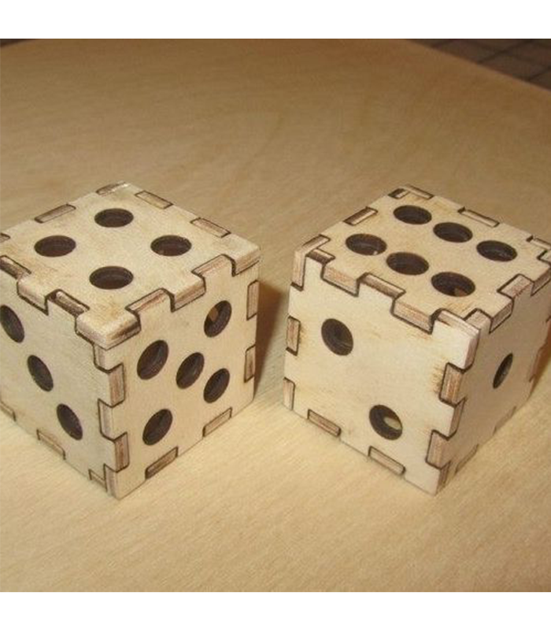

<html>
    <head>
        <meta charset="utf-8">
        <meta name="viewport" content="width=device-width, initial-scale=1">
        <title>Temporizador 555</title>
	    <link rel="preconnect" href="https://fonts.googleapis.com"> <!-- Estas lineas de google fonts son para implementar fuentes de texto en la pagina web -->
	    <link rel="preconnect" href="https://fonts.gstatic.com" crossorigin>
	    <link href="https://fonts.googleapis.com/css2?family=Caacupe+One&family=DM+Sans:ital,opsz,wght@0,9..40,100..1000;1,9..40,100..1000&family=Passion+One:wght@400;700;900&display=swap" rel="stylesheet">
        
    </head>
    <body markdown="1">
        <h1>Ensamblaje</h1>
        <h2>Reporte de la práctica</h2>
        
El viernes 4 de abril aprendimos sobre el ensamblaje de piezas cortadas con laser, recomendaciones al momento de diseñar las piezas como hacer un boceto antes de empezar a diseñar, donde hacer las muescas en cada pieza para unirlas correctamente después. Esto nos servirá para hacer nuestro proyecto del periodo, que se evaluará dependiendo de como se mantenga unido luego de algunas pruebas del profesor

        <h2>Ejemplo del cubo/progreso del cubo</h2>
        
        <a href="../../recursos/archivos/EnsamblajeCubo.SLDPRT">Archivo del cubo (no terminado)</a>
    </body>
</html>