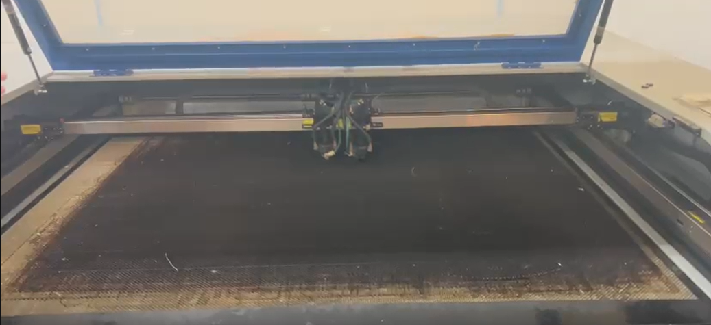

<html>
    <head>
        <meta charset="utf-8">
        <meta name="viewport" content="width=device-width, initial-scale=1">
        <title>Temporizador 555</title>
	    <link rel="preconnect" href="https://fonts.googleapis.com"> <!-- Estas lineas de google fonts son para implementar fuentes de texto en la pagina web -->
	    <link rel="preconnect" href="https://fonts.gstatic.com" crossorigin>
	    <link href="https://fonts.googleapis.com/css2?family=Caacupe+One&family=DM+Sans:ital,opsz,wght@0,9..40,100..1000;1,9..40,100..1000&family=Passion+One:wght@400;700;900&display=swap" rel="stylesheet">
        
    </head>
    <body markdown="1">
        <h1>Explicación uso de la cortadora laser</h1>
        <h2>Reporte de la demostración</h2>
        
El martes 8 de septiembre fuimos al salón en el que se ubica una de las cortadoras laser a que nos explicaran como usarla para el momento en el que vayamos a cortar las piezas requeridas para ensamblar nuestro proyecto. El profesor nos dio una explicacion paso a paso de que hacer para encender la cortadora laser, recalcando la importancia del orden de estos, y luego nos dejó intentarlo nosotros para checar si recordabamos tal orden.

        <h2>Video de la explicacion</h2>
        
    </body>
</html>