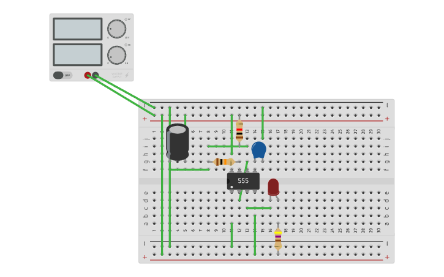
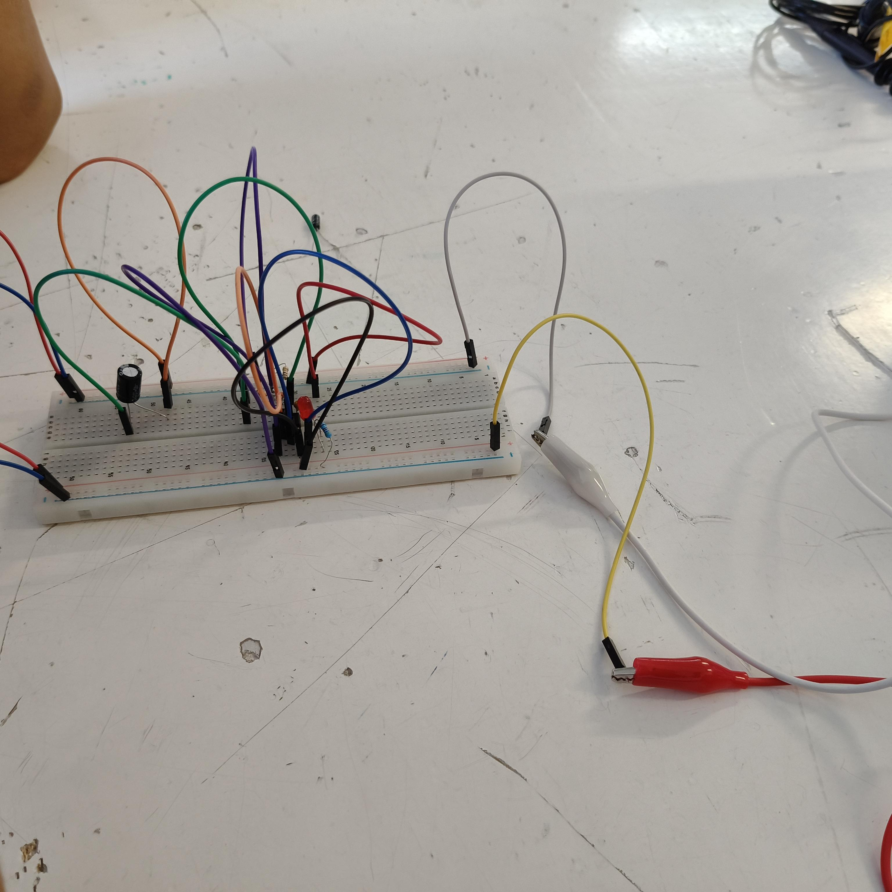

<html>
    <head>
        <meta charset="utf-8">
        <meta name="viewport" content="width=device-width, initial-scale=1">
        <title>Temporizador 555</title>
        <link rel="icon" type="image/png" href="https://img.icons8.com/?size=100&id=1581&format=png" sizes="32x32">
	    <link rel="preconnect" href="https://fonts.googleapis.com"> <!-- Estas lineas de google fonts son para implementar fuentes de texto en la pagina web -->
	    <link rel="preconnect" href="https://fonts.gstatic.com" crossorigin>
	    <link href="https://fonts.googleapis.com/css2?family=Caacupe+One&family=DM+Sans:ital,opsz,wght@0,9..40,100..1000;1,9..40,100..1000&family=Passion+One:wght@400;700;900&display=swap" rel="stylesheet">
        
    </head>
    <body markdown="1">
        <h1>Temporizador 555</h1>
        
Este es un temporizador basado en el circuito integrado 555.

        <table border="1">
            <tr>
                <th>Magnitud</th>
                <th>Teórico (Calculado)</th>
                <th>Medido</th>
                <th>% de error</th>
                <th>¿Con qué lo mediste?</th>
            </tr>
            <tr>
                <td>Vcc(V)</td>
                <td>5.0</td>
                <td>5.025</td>
                <td>0.5%</td>
                <td>Multímetro (V, en paralelo)</td>
            </tr>
            <tr>
                <td>V de salida en ALTO (V)</td>
                <td>≈ Vcc - 1.5</td>
                <td>4.40V</td>
                <td>25.71%</td>
                <td>Multímetro / osciloscopio</td>
            </tr>
            <tr>
                <td>Frecuencia (Hz)</td>
                <td>0.69</td>
                <td>0.67</td>
                <td>2.90%</td>
                <td>Osciloscopio / DMM con Hz</td>
            </tr>
            <tr>
                <td>Duty (%)</td>
                <td>52.4</td>
                <td>51.4</td>
                <td>1.91%</td>
                <td>Osciloscopio (Measure)</td>
            </tr>
            <tr>
                <td>I del LED (mA)</td>
                <td>(V out - Vf)/330</td>
                <td>52.05</td>
                <td>0.96%</td>
                <td>Multímetro (A, en serie)</td>
            </tr>
        </table>
        <h2>Explicación de las diferencias en las tablas de verdad</h2>
        
Nosotros creemos que las diferencias que se dieron comparando la tabla con nuestra 
        medición puede ser el capacitor ya que si bien son de la misma capacidad investigamos que 
        podría variar un poco por diferentes razones, otra razón creemos que seria que los cables no 
        estaban conectados correctamente al protoboard esto porque talvez el protoboard ya 
        estaba un poco usado o por el mismo movimiento de conectar cables se pudo haber 
        aflojado uno y eso hacía que no pasara toda la corriente a los componentes necesarios

        <h2>Video de Explicación del Timer</h2>
        <iframe 
        width="315" 
        height="560" 
        src="https://youtube.com/embed/l6uhHZYHt_Q" 
        title="YouTube video player" 
        frameborder="0" 
        allow="accelerometer; autoplay; clipboard-write; encrypted-media; gyroscope; picture-in-picture; web-share" 
        allowfullscreen>
        </iframe>
        <h2>Esquemáticos en Tinkercad</h2>

        <h2>Montaje en protoboard</h2>

        <h2>Bitácora de errores</h2>
        
Al principio el Led no encendía y no sabíamos porque , para solucionar este problema primero nos aseguramos que la fuente de alimentación fuera la correcta, después comprobamos que nuestro Led estuviera funcionando correctamente y no estuviera quemado, después de eso comparamos el protoboard con el de la imagen para ver que todo estuviera en su lugar, ahí nos dimos cuenta que nos hacía falta una conexión lo que cual impedía que la corriente pasara por todo el circuito, lo conectamos correctamente y nuestro Led prendió con normalidad

        
Se usó la IA Gemini para consultar como insertar el video y las imagenes apropiadamente en la página.

    </body>
</html>