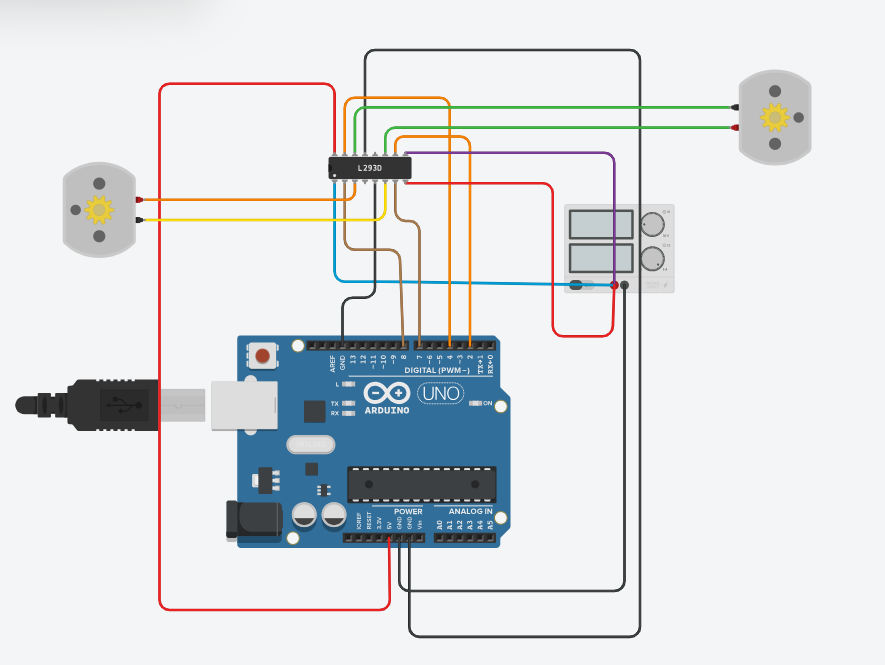
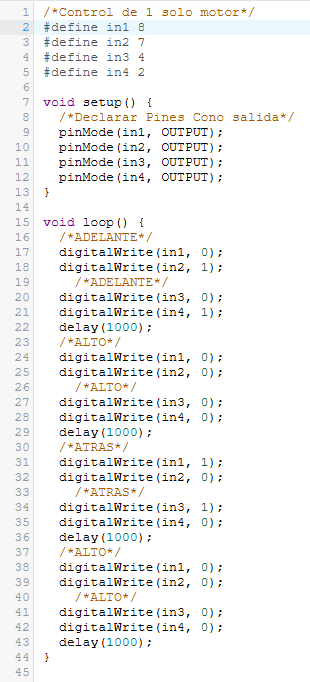
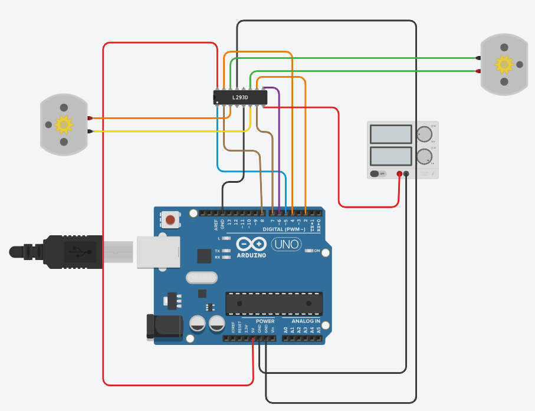
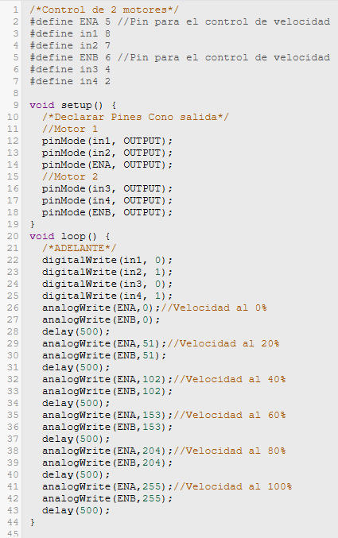
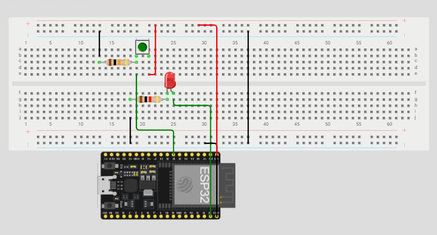
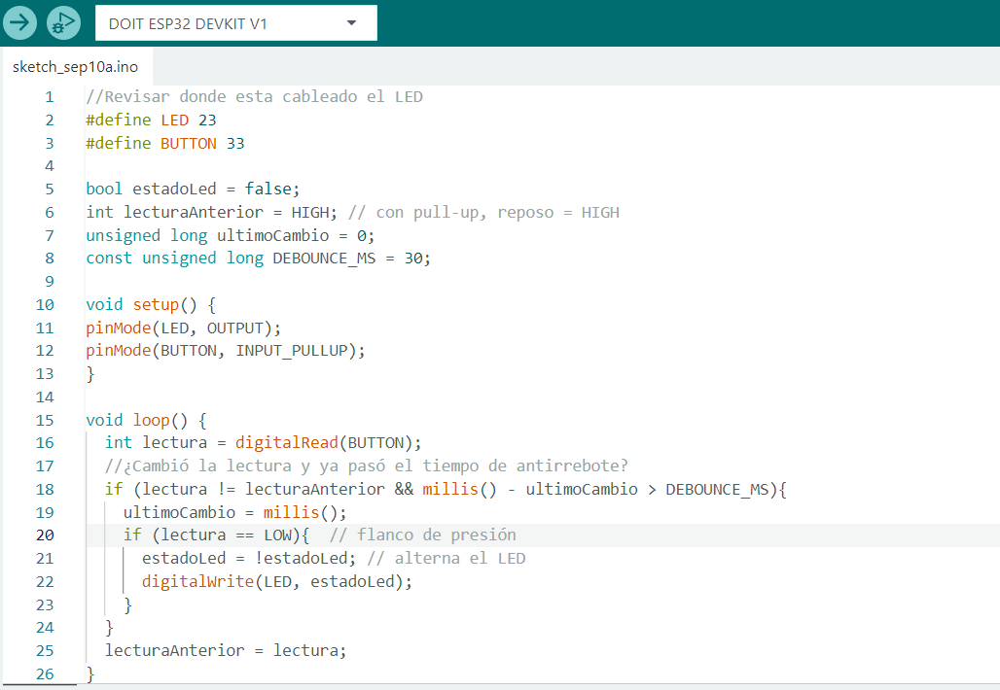

<html>
    <head>
        <meta charset="utf-8">
        <meta name="viewport" content="width=device-width, initial-scale=1">
        <title>Temporizador 555</title>
	    <link rel="preconnect" href="https://fonts.googleapis.com"> <!-- Estas lineas de google fonts son para implementar fuentes de texto en la pagina web -->
	    <link rel="preconnect" href="https://fonts.gstatic.com" crossorigin>
	    <link href="https://fonts.googleapis.com/css2?family=Caacupe+One&family=DM+Sans:ital,opsz,wght@0,9..40,100..1000;1,9..40,100..1000&family=Passion+One:wght@400;700;900&display=swap" rel="stylesheet">
        
    </head>
    <body markdown="1">
        <h1>Actuadores 101</h1>
        <h2>Dirección (motor DC)</h2>
        
        
(hacer click en la imagen ^ para el video)

        
        <h2>Velocidad (motor DC)</h2>
        
        
(hacer click en la imagen ^ para el video)

        
        <h2>Bounce</h2>
       <a href="../../recursos/videos/VideoBounce.mp4">
             <!-- Mismo esquematico -->
        </a>
        
(hacer click en la imagen para el video)

        
        <h2>¿Que es el Rebote de un Boton?</h2>
        
El rebote de un botón ocurre cuando presionamos el botón de 
        nuestro circuito , son como micro pulsaciones que detecta 
        aunque solo hayas presionado el botón una vez , no es 
        detectable ah simple vista , el rebote puede afectar un poco ya 
        que aunque nosotros no lo podemos ver el sistema si , lo que 
        ocasiona que interprete una pulsación como varias y en nuestro 
        circuito se apague y se prenda el led de manera muy rápida.

        <h2>¿Por qué con INPUT_PULLUP la lógica queda invertida?</h2>
        
Cuando usamos INPUT_PULLUP en Arduino, la forma en que se 
        leen los valores del botón cambia un poco. Normalmente 
        cuando presionamos un botón obtenemos un 1 (HIGH) y 
        cuando no lo presionamos obtenemos un 0 (LOW). Pero 
        con INPUT_PULLUP pasa lo contrario.  
        Esto pasa porque Arduino utiliza una resistencia interna que 
        mantiene el pin en HIGH cuando el botón está sin presionar, 
        mientras no hacemos nada, Arduino está leyendo un 1, 
        entonces cuando presionamos el boton hace conexión con 
        GND (tierra) y al estar conectado a tierra el pin pasa a LOW , lo 
        que significa que es 0 y por lo tanto el Led se apaga.

        <h2>Reporte de Fallas</h2>
        
En esta practica el unico erros que tuvimos fue que nos falto conectar un jumper y por lo tanto nuestro Led no prendia.
        Lo que hicimos para solucionarlo fue revisar que todo estuviera correctamente colocado y conectar el jumper que nos hacia falta

    </body>
</html>