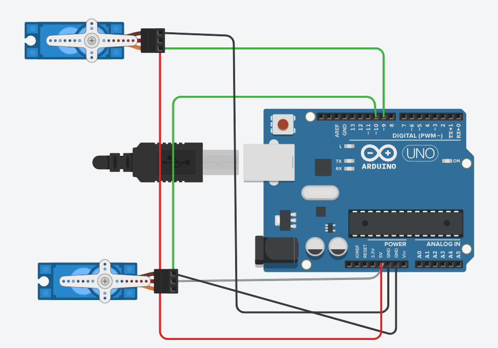
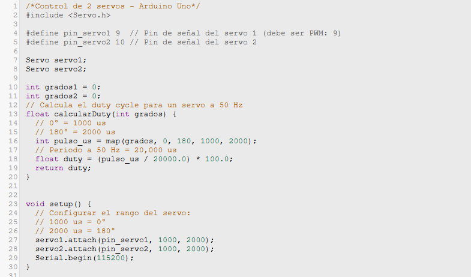
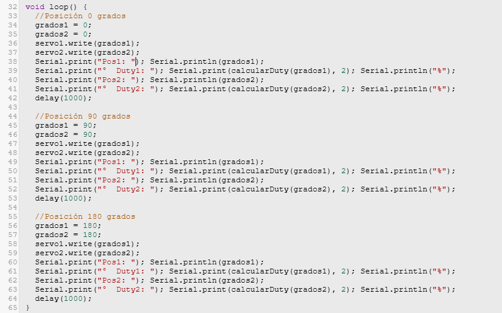

<html>
    <head>
        <meta charset="utf-8">
        <meta name="viewport" content="width=device-width, initial-scale=1">
        <title>Temporizador 555</title>
	    <link rel="preconnect" href="https://fonts.googleapis.com"> <!-- Estas lineas de google fonts son para implementar fuentes de texto en la pagina web -->
	    <link rel="preconnect" href="https://fonts.gstatic.com" crossorigin>
	    <link href="https://fonts.googleapis.com/css2?family=Caacupe+One&family=DM+Sans:ital,opsz,wght@0,9..40,100..1000;1,9..40,100..1000&family=Passion+One:wght@400;700;900&display=swap" rel="stylesheet">
        
    </head>
    <body markdown="1">
        <h1>Actuadores 101</h1>
        <h2>Dirección (motor DC)</h2>
        
        
(hacer click en la imagen ^ para el video)

        
        <h2>Velocidad (motor DC)</h2>
        
        
(hacer click en la imagen ^ para el video)

        
        <h2>Servo Posicion y Duty</h2>
       
        
(hacer click en la imagen ^ para el video)

        
        
        <h2>Explicación</h2>
        

        En el código del Motor Direccion es un programa que controla las direcciones de dos motores al mismo tiempo, cambiando entre atras y adelante según los verdaderos y falsos que se mandan a cada motor, y parando si ambos valores son falsos.
         En el código del Motor Velocidad es un programa que controla la velocidad a la que se mueve el motor, incrementando en intervalos de 20%, cada uno subiendo por 51, pues es el 20% de 255.
         En el código del SERVO RC CALCULO DUTY lo que podemos ver es que es un programa que mueve dos servomotores en sincronía, haciéndolos pasar repetidamente por tres posiciones: 0°, 90° y 180°, con una pausa de 1 segundo entre cada movimiento. Al llegar al final, vuelve a empezar desde 0°, y así indefinidamente mientras el Arduino esté encendido. Al mismo tiempo, cada vez que cambia de posición, llama a una función para calcular el Duty.

        <h2>Reporte de Fallas</h2>
        
El principal problema que tuvimos fue que el código que nos había dado no era compatible con el sistema de tinkercad ya que no contaba con los elementos para los que estaba echo el código. La solución que le dimos fue modificar el código para que funcionara con los sistemas de tinkercad.

        <h2>Conclusiones</h2>
        
En conclusión este código es básico de cómo hacer que un Arduino controle el movimiento de dos motores y servos al mismo tiempo, controlando la direccion de movimiento y la velocidad de los motores, y llevando los servos paso a paso por tres posiciones fijas de forma repetitiva mientras se calcula el Duty con cada cambio, sin que nada externo lo interrumpa o modifique. 

    </body>
</html>