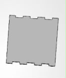
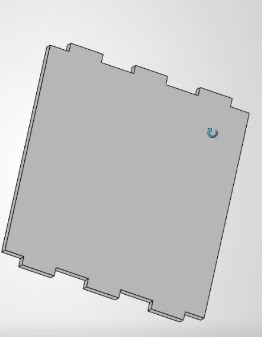
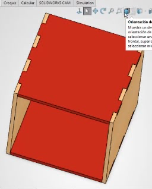
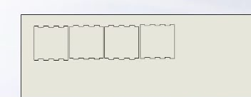
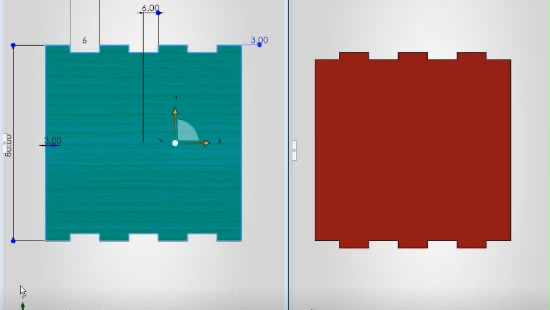

# Diseño de caja en Solidworks
## (4/Septiembre/2026)

En esta clase el profesor nos enseño a como modelar un ensamblado de una caja.

Priero el profesor nos explico que para tener una idea mas clara de lo que ibamos a hacer primero teniamos uqe hacerlo en un boceto y de ahi pasarlo al programa.

Ya que teniamos echo el boceto pasamos a solidworks a configurar la pagina donde ibamos a trabajar, nos explico que para que las medidas quedaran mas exactas las pusieramos en milimetros, ya que al momento de cortar la cortadora se comia pedazos del material.

Primero dibujamos un cuadrado y les dimos las medidas que ibamos a ocupar, despues con una herramineta del programa duplicamos un dibujo lo cual nos hizo mas facil y rapido el trazo, ya que teniamos echa la cara del cubo pasamos a la parte de **OPERACION** en el programa donde extruimos la pieza para darle volumen.

Ya que teniamos la primera pieza teniamos que hacer la parte de arriba y para ello realizamos los mismos procedimientos pero con diferentes medidas, cuando tuvimos las dos piezas las juntamos en un mismo archivo y las hicimos coincidir en ciertas partes las cuales nos iban a decir si el ensamblaje estuvo bien o habia que modificarlo.

Al final se esporto el archivo con una terminacion especifica para que se pudiera cortar en una cortadora laser.

# Conclusiones 

En esta practica aprendi a modelar y a como usar diferentes herramientas para lograr que dos piezas al final se puedan ensamblar.

# Imagenes del Cubo en Solidworks

