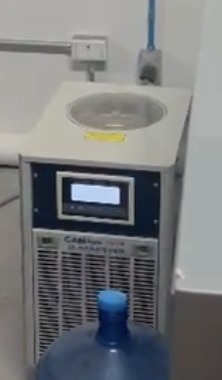
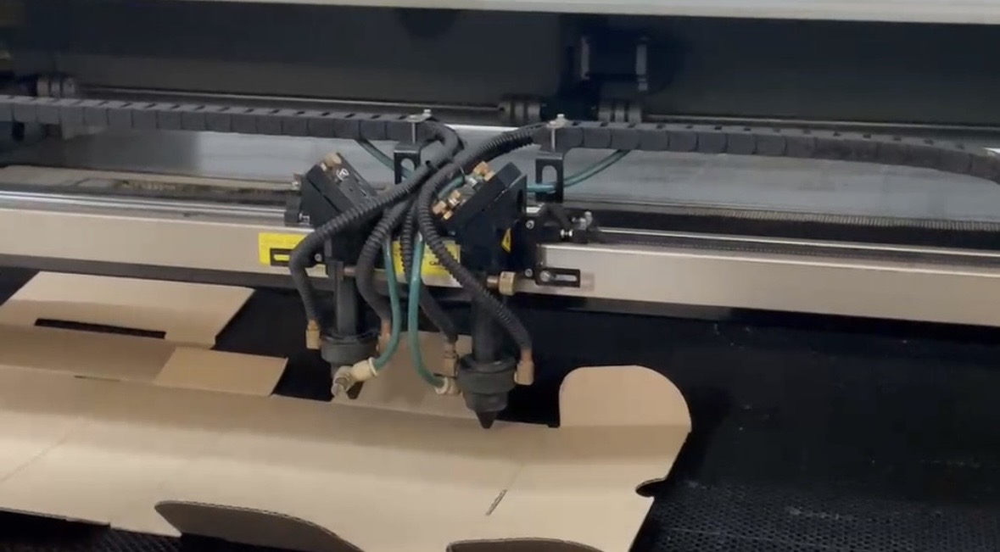

# Cortadora Lasér 
## (8/Septiembre/2026)

En esta sesion nos vimos con el profesor en el area de cortadoras laser ya que nos iba a enseñar a usar las cortadoras de manera segura y eficaz.

Para empezar el profesor nos explico como se tenia que prender la cortadora, primero tenias que prender un switch el cual iba a encender el aparato que enfriaba la cortadora y evitaba que se incendiara.

Despues de corroborar que todo estuviera bien pasamos a encender la cortadora y para ello teniamos que activar las tres partes las cuales eran, encender e switch que estaba a un costado de la cortadora, desactivar el freno de emergencia y por ultimo poner y girar una llave que el profesor nos dio.

Ya con la maquina encendida el profesor nos empezo a explicar como se podia mover ah diferemtes lugares con las flechas que la cortadora trae, nos explico que empezba a cortar de arriba para abajo y que lo trataramos de hacer en lo mas en la esquina posibe para ahorrar material, algo importante que nos dijeron fue que el material nos aseguraramos que estuviera firme y no se moviera.

La cortadora contaba con dos lasers y nos explicaron que si el laser quedaba muy arriba del materia el corte probablemente no saldria como el esperado, la medida correcta a la que tiene que estar el laser es de 5mm 

"

Ya que teniamos bien calibrada la cortadora nos pasamos a la computadora para poder ver la vista previa de como ssaldria el corte, en esta pagina podiamos modificar diferentes conceptos como la potencia del laser, el tamaño que quieras ocupar y algo importante que nos dijo el profesor fue que en las partes curvas del corte en la seccion de **velocidad minima** disminuyera la potencia del laser para que asi no quemara la pieza, ya que estaba todo listo lo mandamos a cortar y comprobamos los resultados.

Al terminar de usar la cortadora seguimos los mismos pasos para prenderla como quitar la llave, regresar el freno de emergencia y apagar el switch de la cortadora y del aparato que la enfriaba, ya que estaba apagada limpiamos la cortadora ya que no se podia quedar sucia.

# Conclusiones 

En esta practica aprendi a usar una cortadora laser y ah las diferentes combinaciones para hacer grabados en algunos materiales y no solo cortarlos.